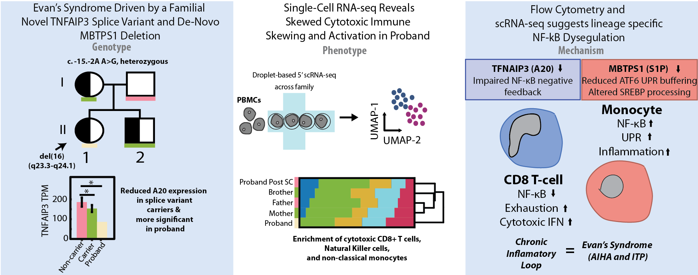

Single-cell Profiling Defines the Familial Immunophenotype of a Family with an Individual with Paediatric Evans Syndrome Carrying a Novel A20 Splice-Site Variant
============================================================================================================================================================================================================================================================

.. attention::
   ***Under construction***

Abstract 
-------------------------
*Background*
Evans syndrome (ES) is a rare autoimmune disorder defined by the co-occurrence of autoimmune cytopenias and characterised by severe, relapsing disease. Although ES is associated with immune dysregulation, the underlying molecular architecture remains incompletely defined. TNFAIP3 encodes A20, a critical negative regulator of NF-κB signalling. While coding loss-of-function variants in TNFAIP3 are linked to autoimmunity, the impact of non-coding regulatory variants and locus-level structural alterations on lineage-specific immune programs is less well understood.

*Objective*
We sought to define the genetic and immunological mechanisms underlying severe paediatric ES in a child carrying a novel TNFAIP3 splice acceptor mutation (c.-15-2A>G) together with a heterozygous 16q23.3–q24.1 deletion encompassing MBTPS1. We further aimed to determine how regulatory perturbations at these loci reshape immune cell states using integrated family-matched genomic and single-cell analyses.

*Methods*
A 4-year-old patient with severe, treatment-refractory ES underwent family-based genomic and immunophenotypic assessment. Sanger sequencing, in silico modelling, and a mini-gene assay were used to characterise the TNFAIP3 splice-site variant. Peripheral blood mononuclear cells from family members were analysed using multiparameter flow cytometry and droplet-based single-cell RNA sequencing. Transcriptional programs were evaluated at the level of gene modules and pathway activity to resolve lineage-specific regulatory rewiring.

*Results*
The TNFAIP3 c.-15-2A>G variant was identified in three family members, two of whom exhibited mild autoimmune features. The proband, uniquely harbouring the 16q23.3–q24.1 deletion, developed severe ES. Splicing assays demonstrated disruption of the canonical acceptor site with activation of a downstream cryptic site; however, PBMCs from carriers showed no detectable aberrant transcript accumulation, suggesting dosage or regulatory effects rather than overt transcript truncation.

Flow cytometry revealed elevated basal CD154, PD-1, and Ki-67 expression, consistent with chronic T-cell activation. Single-cell transcriptomics demonstrated expansion of cytotoxic CD8⁺ T cells and NK cells, contraction of B and CD4⁺ T compartments, and lineage-specific NF-κB pathway remodelling. Monocytes exhibited increased NF-κB-responsive and stress-associated programs, whereas CD8⁺ T cells showed a mixed cytotoxic–exhausted transcriptional state with relative attenuation of canonical NF-κB signalling modules.

The 16q23.3–q24.1 deletion, encompassing MBTPS1, suggests impaired cleavage of ATF6 and altered SREBP processing, linking endoplasmic reticulum stress responses to inflammatory amplification. Together, these findings indicate convergent regulatory perturbations that remodel immune programs in a cell-type-specific manner.

*Conclusion*
This study defines a familial regulatory architecture underlying paediatric ES. Rather than uniform NF-κB hyperactivation, we identify lineage-specific NF-κB rewiring: inflammatory NF-κB-high monocytes co-exist with chronically stimulated CD8⁺ T cells adopting a cytotoxic–exhausted state. The TNFAIP3 splice-site variant and MBTPS1-containing deletion appear to converge on stress-responsive and inflammatory transcriptional circuits, analogous to promoter-specific regulatory divergence observed in isoform-resolved perturbation studies. These data expand the spectrum of regulatory inborn errors of immunity in ES and highlight how spatial and regulatory disruption of transcriptional control can drive distinct immune cell programs within the same genetic background.

Analysis Pipeline Overview
--------------------------

References
----------

.. toctree::
   :maxdepth: 1
   :caption: Analysis Pipeline:

  data_processing_quantification
  cell_annotation_clustering
  regulatory_program_inference
  differential_and_neighbourhood_analysis
  targeted_locus_analysis
  
